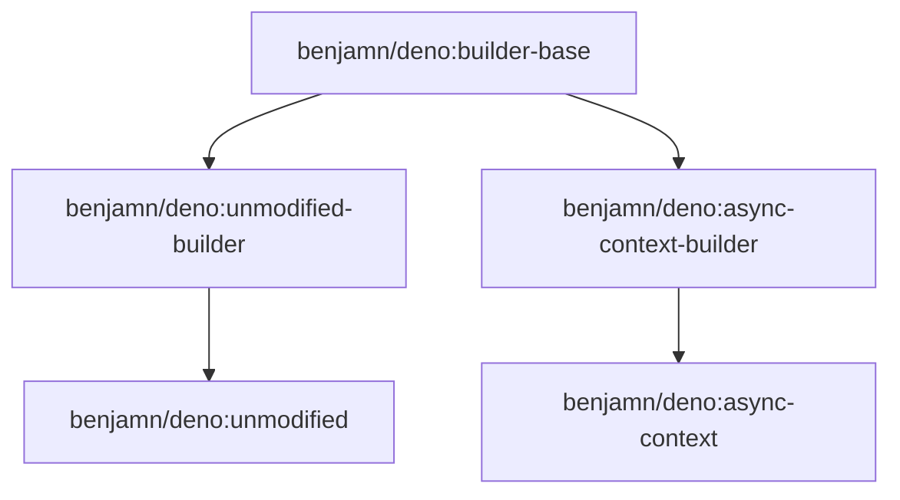

# Docker build scripts (added by [`benjamn/deno`](https://github.com/benjamn/deno))

As described in the [top-level
`README.md`](https://github.com/benjamn/deno/blob/docker-builds/README.md#purpose-of-this-fork-benjamndeno),
this fork exists to allow building custom versions of [Deno](https://github.com/denoland/deno) and distributing them using [Docker](https://www.docker.com/).

## Relationships between `Dockerfile`s

Currently there are two multi-stage build pipelines, resulting in final images named `benjamn/deno:unmodified` and `benjamn/deno:async-context`. See the file [`./docker-build-all.sh`](docker-build-all.sh) in this directory for the commands I use to publish these tagged images.
